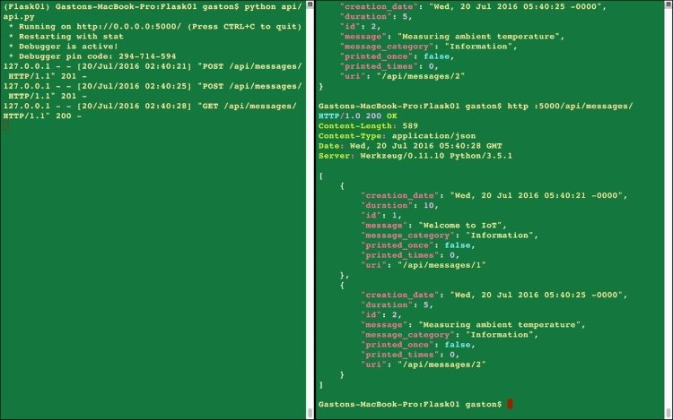

# Разработка RESTful API с Flask (часть 2)

## Выполнение HTTP-запросов к API Flask

Теперь мы можем запустить скрипт `api/api.py`, который запускает сервер разработки **Flask** для составления и отправки HTTP-запросов к нашему незащищенному и простому веб-API (позже мы обязательно добавим безопасность). Выполните следующую команду.

```bash
python api/api.py
```

Следующие строки показывают вывод после выполнения предыдущей команды. Сервер разработки прослушивает порт `5000`.

```bash
* Running on http://127.0.0.1:5000/ (Press CTRL+C to quit)
* Restarting with stat
* Debugger is active!
* Debugger pin code: 294-714-594
```

С помощью предыдущей команды мы запустим сервер разработки **Flask**, и мы сможем получить к нему доступ только на нашем компьютере для разработки. Предыдущая команда запускает сервер разработки с IP-адресом по умолчанию, то есть `127.0.0.1` (**localhost**). Невозможно получить доступ к этому IP-адресу с других компьютеров или устройств, подключенных к нашей локальной сети. Таким образом, если мы хотим делать HTTP-запросы к нашему API с других компьютеров или устройств, подключенных к нашей локальной сети, мы должны использовать IP-адрес компьютера разработки, `0.0.0.0` (для конфигураций **IPv4**) или `::` (для конфигураций **IPv6**), в качестве желаемого IP-адреса для нашего сервера разработки.

Если мы укажем `0.0.0.0` в качестве желаемого IP-адреса для конфигураций **IPv4**, сервер разработки будет прослушивать каждый интерфейс на порту `5000`. Кроме того, необходимо открыть порт `5000` по умолчанию в наших брандмауэрах (программных и/или аппаратных) и настроить переадресацию портов на компьютер, на котором запущен сервер разработки.

Нам просто нужно указать `«0.0.0.0»` в качестве значения аргумента хоста при вызове метода `app.run`, в частности, последней строки в файле `api/api.py`. В следующей строке показан новый вызов `app.run`, который запускает сервер разработки **Flask** в конфигурации **IPv4** и позволяет выполнять запросы с других компьютеров и устройств, подключенных к нашей локальной сети. Строка генерирует внешне видимый сервер. Файл кода для примера включен в папку `restful_python_chapter_05_02`:

```python
if __name__ == '__main__':
    app.run(host='0.0.0.0', debug=True)
```


**СОВЕТ**

Если вы решите составлять и отправлять HTTP-запросы с других компьютеров или устройств, подключенных к локальной сети, помните, что вы должны использовать назначенный компьютеру разработки IP-адрес вместо локального хоста. Например, если компьютеру назначен IP-адрес **IPv4** `192.168.1.103`, вместо `localhost:5000` следует использовать `192.168.1.103:5000`. Конечно, вы также можете использовать имя хоста вместо IP-адреса. Объясненные ранее конфигурации очень важны, поскольку мобильные устройства могут быть потребителями наших API RESTful, и мы всегда будем хотеть тестировать приложения, использующие наши API, в наших средах разработки. Кроме того, мы можем работать с полезными инструментами, такими как **ngrok**, которые позволяют нам создавать безопасные туннели к локальному хосту. Вы можете прочитать больше информации о **ngrok** на [https://www.ngrok.com](https://www.ngrok.com/).


Сервер разработки **Flask** работает на локальном хосте (`127.0.0.1`), прослушивает порт `5000` и ожидает наших HTTP-запросов. Теперь мы будем составлять и отправлять HTTP-запросы локально на нашем компьютере для разработки или с другого компьютера или устройств, подключенных к нашей локальной сети.

## Работа с инструментами командной строки curl и httpie

Мы начнем составлять и отправлять HTTP-запросы с помощью инструментов командной строки, которые мы представили в [главе 1](../razrabotka-restful-api-s-django.md) «Разработка RESTful API с помощью Django, curl и HTTPie». Если вы не установили **HTTPie**, убедитесь, что вы активировали виртуальную среду, а затем выполните следующую команду в терминале или командной строке, чтобы установить пакет **HTTPie**.

```bash
pip install --upgrade httpie
```


**СОВЕТ**

Если вы не помните, как активировать виртуальную среду, которую мы создали для этого примера, прочитайте следующий раздел в этой главе — **Настройка виртуальной среды с помощью Django REST framework**.


Откройте терминал **Cygwin** в Windows или терминал в macOS или Linux и выполните следующую команду. Очень важно ввести косую черту в конце (`/`), так как указанный `/api/messages` не соответствует ни одному из настроенных маршрутов URL. Таким образом, мы должны ввести `/api/messages/`, включая косую черту (`/`). Составим и отправим HTTP-запрос на создание нового сообщения:

```python
http POST :5000/api/messages/ message='Welcome to IoT' duration=10
message_category='Information'
```

Ниже приведена эквивалентная команда **curl**. Очень важно использовать опцию **-H** **«Content-Type: application/json»**, чтобы указать **curl** для отправки данных, указанных после опции **-d**, как **application/json** вместо **application/x-www-form-urlencoded** по умолчанию:

```bash
curl -iX POST -H "Content-Type: application/json" -d '{"message":"Welcome to
IoT", "duration":10, "message_category": "Information"}' :5000/api/messages/
```

Предыдущие команды составят и отправят следующий HTTP-запрос: **POST** `http://localhost:5000/api/messages/` со следующими парами ключ-значение **JSON**:

```json
{
    "message": "Welcome to IoT",
    "duration": 10,
    "message_category": "Information"
}
```

В запросе указывается `/api/messages/`, поэтому он будет соответствовать `'/api/messages/'` и запускать метод `MessageList.post`. Метод не получает аргументов, так как URL-маршрут не содержит никаких параметров. Поскольку HTTP запрос для **POST**, **Flask** вызывает метод **post**. Если новая модель **MessageModel** была успешно сохранена в словаре, функция возвращает код состояния **HTTP 201 Created**, а недавно сохраненная модель **MessageModel** сериализована в **JSON** в теле ответа. В следующих строках показан пример ответа на HTTP-запрос с новым объектом **MessageModel** в ответе **JSON**:

```http
HTTP/1.0 201 CREATED
Content-Length: 245
Content-Type: application/json
Date: Wed, 20 Jul 2016 04:43:24 GMT
Server: Werkzeug/0.11.10 Python/3.5.1
{
    "creation_date": "Wed, 20 Jul 2016 04:43:24 -0000",
    "duration": 10,
    "id": 1,
    "message": "Welcome to IoT",
    "message_category": "Information",
    "printed_once": false,
    "printed_times": 0,
    "uri": "/api/messages/1"
}
```

Мы составим и отправим HTTP-запрос для создания другого сообщения. Вернитесь к терминалу **Cygwin** в Windows или терминалу в macOS или Linux и выполните следующую команду:

```bash
http POST :5000/api/messages/ message='Measuring ambient temperature'
duration=5 message_category='Information'
```

Ниже приведена эквивалентная команда **curl**:

```bash
curl -iX POST -H "Content-Type: application/json" -d '{"message":"Measuring
ambient temperature", "duration":5, "message_category": "Information"}'
:5000/api/messages/
```

Предыдущие команды составят и отправят следующий HTTP-запрос **POST** `http://localhost:5000/api/messages/` со следующими парами ключ-значение **JSON**:

```json
{
  "message": "Measuring ambient temperature",
  "duration": 5,
  "message_category": "Information"
}
```

В следующих строках показан пример ответа на HTTP-запрос с новым объектом **MessageModel** в ответе **JSON**:

```http
HTTP/1.0 201 CREATED
Content-Length: 259
Content-Type: application/json
Date: Wed, 20 Jul 2016 18:27:05 GMT
Server: Werkzeug/0.11.10 Python/3.5.1
{
    "creation_date": "Wed, 20 Jul 2016 18:27:05 -0000",
    "duration": 5,
    "id": 2,
    "message": "Measuring ambient temperature",
    "message_category": "Information",
    "printed_once": false,
    "printed_times": 0,
    "uri": "/api/messages/2"
}
```

Мы составим и отправим HTTP-запрос для получения всех сообщений. Вернитесь к терминалу **Cygwin** в Windows или терминалу в macOS или Linux и выполните следующую команду:

```bash
http :5000/api/messages/
```

Ниже приведена эквивалентная команда **curl**:

```bash
curl -iX GET -H :5000/api/messages/
```

Предыдущие команды составят и отправят следующий HTTP-запрос: **GET** `http://localhost:5000/api/messages/`. В запросе указывается `/api/messages/`, поэтому он будет соответствовать `'/api/messages/'` и запускать метод `MessageList.get`. Метод не получает аргументов, так как URL-маршрут не содержит никаких параметров. Поскольку HTTP запрос для **GET**, **Flask** вызывает метод **get**. Метод извлекает все объекты **MessageModel** и генерирует ответ **JSON** со всеми сериализованными объектами **MessageModel**.

В следующих строках показан пример ответа на HTTP-запрос. Первые строки показывают заголовки ответа HTTP, включая статус (**200 OK**) и тип контента (`application/json`). После заголовков ответа HTTP мы можем увидеть подробности для двух объектов **MessageModel** в ответе **JSON**:

```http
HTTP/1.0 200 OK
Content-Length: 589
Content-Type: application/json
Date: Wed, 20 Jul 2016 05:32:28 GMT
Server: Werkzeug/0.11.10 Python/3.5.1
[
    {
        "creation_date": "Wed, 20 Jul 2016 05:32:06 -0000",
        "duration": 10,
        "id": 1,
        "message": "Welcome to IoT",
        "message_category": "Information",
        "printed_once": false,
        "printed_times": 0,
        "uri": "/api/messages/1"
    },
    {
        "creation_date": "Wed, 20 Jul 2016 05:32:18 -0000",
        "duration": 5,
        "id": 2,
        "message": "Measuring ambient temperature",
        "message_category": "Information",
        "printed_once": false,
        "printed_times": 0,
        "uri": "/api/messages/2"
    }
]
```

После того, как мы запустим три запроса, мы увидим следующие строки в окне, в котором запущен сервер разработки **Flask**. Выходные данные показывают, что сервер получил три HTTP-запроса, а именно два POST-запроса и один GET-запрос с `/api/messages/` в качестве URI. Сервер обработал три HTTP-запроса, вернул код состояния `201` для первых двух запросов и `200` для последнего запроса:

```bash
127.0.0.1 - - [20/Jul/2016 02:32:06] "POST /api/messages/ HTTP/1.1" 201 -
127.0.0.1 - - [20/Jul/2016 02:32:18] "POST /api/messages/ HTTP/1.1" 201 -
127.0.0.1 - - [20/Jul/2016 02:32:28] "GET /api/messages/ HTTP/1.1" 200 -
```

На следующем изображении показаны два окна терминала рядом друг с другом в macOS. Окно терминала с левой стороны запускает сервер разработки **Flask** и отображает полученные и обработанные HTTP-запросы. Окно терминала с правой стороны запускает команды **http** для генерации HTTP-запросов. Рекомендуется использовать аналогичную конфигурацию для проверки вывода, пока мы составляем и отправляем HTTP-запросы:



Теперь мы составим и отправим HTTP-запрос для получения несуществующего сообщения. Например, в предыдущем списке нет сообщения со значением идентификатора, равным `800`. Выполните следующую команду, чтобы попытаться получить это сообщение. Убедитесь, что вы используете несуществующее значение идентификатора. Мы должны убедиться, что утилиты отображают заголовки как часть ответа, чтобы увидеть возвращенный код состояния:

```bash
http :5000/api/messages/800
```

Ниже приведена эквивалентная команда **curl**:

```bash
curl -iX GET :5000/api/messages/800
```

Предыдущие команды составят и отправят следующий HTTP-запрос: **GET** `http://localhost:5000/api/messages/800`. Запрос такой же, как и предыдущий, который мы проанализировали, с другим номером параметра **id**. Сервер запустит метод `Message.get` с `800` в качестве значения аргумента **id**. Метод выполнит код, который извлекает объект **MessageModel**, идентификатор которого соответствует значению идентификатора, полученному в качестве аргумента. Однако первая строка в методе `MessageList.get` вызывает метод **abort\_if\_message\_doesnt\_exist**, который не найдет идентификатор в ключах словаря и вызовет функцию `flask_restful.abort`, поскольку сообщения с указанным значением идентификатора нет. Таким образом, код вернет код состояния HTTP **404 Not Found**. В следующих строках показан пример ответа заголовка для HTTP-запроса и сообщения, включенного в тело. В этом случае мы просто оставляем сообщение по умолчанию. Конечно, мы можем настроить его в соответствии с нашими конкретными потребностями:

```http
HTTP/1.0 404 NOT FOUND
Content-Length: 138
Content-Type: application/json
Date: Wed, 20 Jul 2016 18:08:04 GMT
Server: Werkzeug/0.11.10 Python/3.5.1
{
    "message": "Message 800 doesn't exist. You have requested this URI
    [/api/messages/800] but did you mean /api/messages/<int:id> ?"
}
```

Наш API может обновлять одно поле для существующего ресурса, поэтому мы предоставляем реализацию метода **PATCH**. Например, мы можем использовать метод **PATCH**, чтобы обновить два поля существующего сообщения и установить для его поля **print\_once** значение `true`, а для поля **print\_times** — `1`. Мы не хотим использовать метод **PUT**, потому что этот метод предназначен для замены всего сообщения. Метод **PATCH** предназначен для применения дельты к существующему сообщению, и, следовательно, это подходящий метод для простого изменения значения полей **print\_once** и **print\_times**.

Теперь составим и отправим HTTP-запрос на обновление существующего сообщения, а именно на обновление значения двух полей. Убедитесь, что вы заменили 2 идентификатором существующего сообщения в вашей конфигурации:

```bash
http PATCH :5000/api/messages/2 printed_once=true printed_times=1
```

Ниже приведена эквивалентная команда **curl**:

```bash
curl -iX PATCH -H "Content-Type: application/json" -d '{"printed_once":"true",
"printed_times":1}' :5000/api/messages/2
```

Предыдущая команда создаст и отправит HTTP-запрос **PATCH** с указанными парами ключ-значение **JSON**. Запрос имеет номер после `/api/messages/`, поэтому он будет соответствовать `'/api/messages/<int:id>'` и запустить метод `Message.patch`, то есть метод **patch** для класса **Message**. Если экземпляр **MessageModel** с указанным идентификатором существует и был успешно обновлен, вызов метода вернет код состояния HTTP **200 OK** и недавно обновленный экземпляр **MessageModel**, сериализованный в **JSON** в тексте ответа. В следующих строках показан пример ответа:

```http
HTTP/1.0 200 OK
Content-Length: 231
Content-Type: application/json
Date: Wed, 20 Jul 2016 18:28:01 GMT
Server: Werkzeug/0.11.10 Python/3.5.1
{
    "creation_date": "Wed, 20 Jul 2016 18:27:05 - 0000",
    "duration": 0,
    "id": 2,
    "message": "Measuring ambient temperature",
    "message_category": "Information",
    "printed_once": true,
    "printed_times": 1,
    "uri": "/api/messages/2"
}
```


**СОВЕТ**

Устройство IoT выполнит описанный выше HTTP-запрос при первом отображении сообщения. Затем он сделает дополнительные запросы **PATCH** для обновления значения поля **print\_times**.


Теперь мы составим и отправим HTTP-запрос на удаление существующего сообщения, в частности, последнего сообщения, которое мы добавили. Как и в наших последних HTTP-запросах, мы должны проверить значение, присвоенное **id** в предыдущем ответе, и заменить 2 в команде на возвращаемое значение:

```bash
http DELETE :5000/api/messages/2
```

Ниже приведена эквивалентная команда **curl**:

```bash
curl -iX DELETE :5000/api/messages/2
```

Предыдущие команды составят и отправят следующий HTTP-запрос: **DELETE** `http://localhost:5000/api/messages/2`. Запрос имеет номер после `/api/messages/`, поэтому он будет соответствовать `'/api/messages/<int:id>'` и запустить метод `Message.delete`, то есть метод удаления для класса **Message**. Если экземпляр **MessageModel** с указанным идентификатором существует и был успешно удален, вызов метода вернет код состояния HTTP **204 No Content**. В следующих строках показан пример ответа:

```http
HTTP/1.0 204 NO CONTENT
Content-Length: 0
Content-Type: application/json
Date: Wed, 20 Jul 2016 18:50:12 GMT
Server: Werkzeug/0.11.10 Python/3.5.1
```

## Работа с инструментами GUI - Postman и другие

До сих пор мы работали с двумя инструментами на основе терминала или командной строки для составления и отправки HTTP-запросов на наш сервер разработки **Flask** — **cURL** и **HTTPie**. Теперь мы будем работать с одним из инструментов с графическим интерфейсом, которые мы использовали при составлении и отправке HTTP-запросов на сервер разработки Django — **Postman**.

Теперь мы будем использовать вкладку **Builder** в Postman, чтобы легко составлять и отправлять HTTP-запросы на `localhost: 5000` и тестировать RESTful API с помощью этого инструмента с графическим интерфейсом. Помните, что Postman не поддерживает сокращения, подобные **curl**, для **localhost**, и поэтому мы не можем использовать те же сокращения, которые мы использовали при составлении запросов с помощью curl и HTTPie.

Выберите **GET** в раскрывающемся меню в левой части текстового поля Введите URL-адрес запроса и введите `localhost: 5000/api/messages/` в это текстовое поле в правой части раскрывающегося списка. Затем нажмите **Send**, и Postman отобразит статус (**200 OK**), время, затраченное на обработку запроса, и текст ответа со всеми играми в формате JSON с подсветкой синтаксиса (**Pretty view**). На следующем снимке экрана показано тело ответа JSON в Postman для HTTP-запроса **GET**.


Нажмите **Headers** справа от **Body** и **Cookies**, чтобы прочитать заголовки ответа. На следующем снимке экрана показан макет заголовков ответов, которые Postman отображает для предыдущего ответа. Обратите внимание, что Postman отображает статус в правой части ответа и не включает его в качестве первой строки заголовков, как это произошло, когда мы работали с утилитами cURL и HTTPie:


Теперь мы будем использовать вкладку **Builder** в Postman для составления и отправки HTTP-запроса для создания нового сообщения, в частности, POST-запроса. Выполните следующие шаги:

1. Выберите **POST** в раскрывающемся меню в левой части текстового поля **Enter request URL** и введите `localhost: 5000/api/messages/` в это текстовое поле в правой части раскрывающегося списка.
2. Нажмите **Body** справа от **Authorization** и **Headers** на панели, которая составляет запрос.
3. Активируйте переключатель **raw** и выберите **JSON (application/json)** в раскрывающемся списке справа от переключателя **binary**. Postman автоматически добавит заголовок `Content-type = application/json`, и поэтому вы заметите, что вкладка **Headers** будет переименована в **Headers (1)**, что указывает нам на то, что для заголовков запроса указана одна пара «ключ-значение».
4. Введите следующие строки в текстовое поле под переключателями на вкладке **Body**:

```json
{
    "message": "Measuring distance",
    "duration": 5,
    "message_category": "Information"
}
```

На следующем снимке экрана показано тело запроса в Postman:


Мы выполнили необходимые шаги, чтобы создать HTTP-запрос **POST** с телом **JSON**, в котором указаны необходимые пары ключ-значение для создания новой игры. Нажмите **Send**, и Postman отобразит статус (**201 Created**), время, которое потребовалось для обработки запроса, и тело ответа с недавно добавленной игрой в формате JSON с подсветкой синтаксиса (**Pretty view**). На следующем снимке экрана показано тело ответа JSON в Postman для запроса HTTP **POST**:



**СОВЕТ**

Если мы хотим составить и отправить запрос HTTP **PATCH** для нашего API с помощью Postman, необходимо выполнить описанные ранее шаги, чтобы предоставить данные JSON в теле запроса.


Щелкните или коснитесь значения поля URL-адреса в теле ответа JSON - `/api/messages/2`. Вы заметите, что значение будет подчеркнуто при наведении на него указателя мыши. Postman автоматически сгенерирует запрос **GET** на адрес `localhost:5000/api/messages/2`. Нажмите **Send**, чтобы запустить его и получить недавно добавленное сообщение. Поле полезно для просмотра API с помощью такого инструмента, как Postman.

Поскольку мы внесли необходимые изменения для создания видимого извне сервера разработки **Flask**, мы также можем использовать приложения, которые могут составлять и отправлять HTTP-запросы с мобильных устройств для работы с RESTful API. Например, мы можем работать с приложением **iCurlHTTP** на устройствах iOS, таких как iPad Pro и iPhone. На устройствах Android мы можем работать с ранее представленным приложением **HTTP Request App**.

На следующем снимке экрана показаны результаты составления и отправки следующего HTTP-запроса с помощью приложения **iCurlHTTP**: `GET http://192.168.2.3:5000/api/messages/`. Помните, что вам необходимо выполнить описанные ранее настройки в вашей локальной сети и маршрутизаторе, чтобы иметь доступ к серверу разработки Flask с других устройств, подключенных к вашей локальной сети. В этом случае IP-адрес, назначенный компьютеру, на котором работает веб-сервер Flask, — `192.168.2.3`, поэтому вы должны заменить этот IP-адрес на IP-адрес, назначенный вашему компьютеру разработки.


## Тест ваших знаний

1. Что из следующего **Flask-RESTful** использует в качестве основного строительного блока для RESTful API?
   1. Ресурсы, созданные поверх подключаемых представлений Flask
   2. Статусы, созданные поверх представлений ресурсов Flask
   3. Ресурсы, созданные на основе подключаемых контроллеров Flask
2. Чтобы иметь возможность обрабатывать HTTP-запрос **POST** к ресурсу, мы должны объявить метод со следующим именем в подклассе `flask_restful.Resource`.
   1. post\_restful
   2. post\_method
   3. post
3. Чтобы иметь возможность обрабатывать HTTP-запрос **GET** к ресурсу, мы должны объявить метод со следующим именем в подклассе `flask_restful.Resource`.
   1. get\_restful
   2. get\_method
   3. get
4. Подкласс `flask_restful.Resource` представляет:
   1. Ресурс контроллера
   2. Ресурс RESTful
   3. Один HTTP-запрос RESTful
5. Если мы используем декоратор `@marshal_with` с **message\_fields** в качестве аргумента, декоратор будет:
   1. Применяет фильтрацию полей и форматирование вывода, указанные в **message\_fields**, к соответствующему экземпляру.
   2. Применяет фильтрацию полей, указанную в **message\_fields**, к соответствующему экземпляру без учета форматирования вывода.
   3. Применяет форматирование вывода, указанное в **message\_fields**, к соответствующему экземпляру без учета фильтрации полей.

## Резюме

В этой главе мы разработали RESTful API для взаимодействия с простым словарем, выступающим в роли хранилища данных, и выполнения операций **CRUD** с сообщениями. Мы определили требования к нашему API и поняли задачи, выполняемые каждым HTTP-методом. Мы настроили виртуальную среду с помощью **Flask** и **Flask-RESTful**.

Мы создали модель для представления и сохранения сообщений. Мы научились настраивать сериализацию сообщений в представления JSON с помощью функций, включенных в **Flask-RESTful**. Мы написали классы, которые представляют ресурсы и обрабатывают различные HTTP-запросы, и настроили шаблоны URL-адресов для маршрутизации URL-адресов к классам.

Наконец, мы запустили сервер разработки Flask и использовали инструменты командной строки для составления и отправки HTTP-запросов к нашему RESTful API и проанализировали, как каждый HTTP-запрос обрабатывался в нашем коде. Мы также работали с инструментами графического интерфейса для составления и отправки HTTP-запросов.

Теперь, когда мы понимаем основы комбинации **Flask** и **Flask-RESTful** для создания API-интерфейсов RESTful, мы расширим возможности веб-API RESTful, воспользовавшись расширенными функциями, включенными в Flask-RESTful и связанных ORM, что мы и собираемся обсудить в следующей главе.
